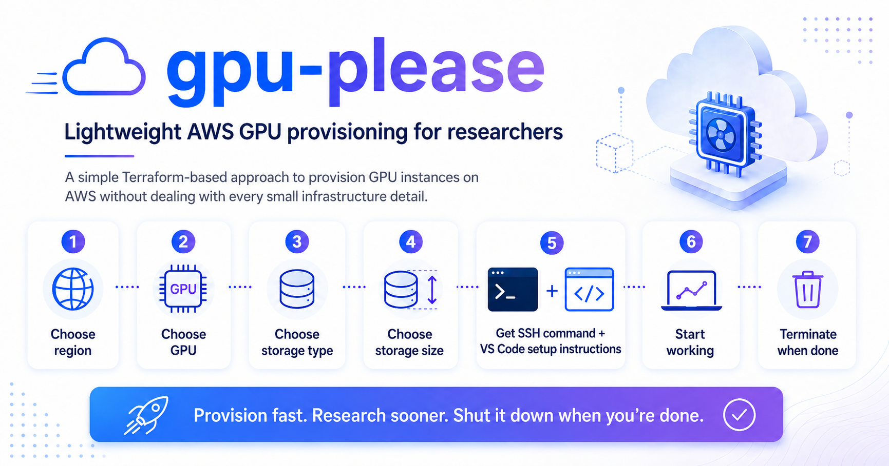

# AWS GPU Instance Provisioner



CLI tool to provision GPU EC2 instances on AWS using Terraform.

## Prerequisites

- [uv](https://docs.astral.sh/uv/getting-started/installation/) — Python package/project manager

  ```bash
  # macOS / Linux
  curl -LsSf https://astral.sh/uv/install.sh | sh
  # or on macOS
  brew install uv
  ```

- [Terraform](https://developer.hashicorp.com/terraform/install) on `$PATH`

  ```bash
  # macOS (per HashiCorp's official instructions — `brew install terraform` no longer works directly)
  brew tap hashicorp/tap
  brew trust hashicorp/tap          # Homebrew 6.x requires explicit trust on third-party taps
  brew install hashicorp/tap/terraform
  # other platforms: see the link above
  ```

- [AWS CLI](https://docs.aws.amazon.com/cli/latest/userguide/getting-started-install.html) (needed for `aws configure` below, plus any manual AWS work like creating an IAM instance profile)

  ```bash
  # macOS
  brew install awscli
  # other platforms: see the link above
  ```

- AWS credentials — see [AWS credentials](#aws-credentials) below.

## AWS credentials

The tool uses `boto3` and Terraform's AWS provider, so it picks up credentials from the standard AWS credential chain. Pick one of:

**Option A — `aws configure` (recommended for laptops):**

```bash
aws configure
# AWS Access Key ID:     AKIA...
# AWS Secret Access Key: ...
# Default region name:   us-east-1
# Default output format: json
```

This writes `~/.aws/credentials` and `~/.aws/config`.

**Option B — environment variables (for CI / shells):**

```bash
export AWS_ACCESS_KEY_ID=AKIA...
export AWS_SECRET_ACCESS_KEY=...
export AWS_DEFAULT_REGION=us-east-1
# If using temporary STS credentials, also set:
export AWS_SESSION_TOKEN=...
```

**Option C — IAM role** when running on an EC2 instance / EKS pod with an attached instance profile (no extra config needed).

Verify it works:

```bash
aws sts get-caller-identity
```

### Minimum IAM permissions

The principal you provision with needs:

- **EC2:** `RunInstances`, `TerminateInstances`, `DescribeInstances`, `DescribeInstanceTypeOfferings`, `DescribeAvailabilityZones`, `DescribeImages`
- **EC2 key pairs:** `CreateKeyPair`, `DeleteKeyPair`, `DescribeKeyPairs`
- **VPC + networking:** `CreateVpc`, `DeleteVpc`, `DescribeVpcs`, `CreateSubnet`, `DeleteSubnet`, `DescribeSubnets`, `CreateInternetGateway`, `AttachInternetGateway`, `DetachInternetGateway`, `DeleteInternetGateway`, `DescribeInternetGateways`, `CreateRouteTable`, `CreateRoute`, `AssociateRouteTable`, `DisassociateRouteTable`, `DeleteRouteTable`, `DescribeRouteTables`
- **Security groups:** `CreateSecurityGroup`, `AuthorizeSecurityGroupIngress`, `AuthorizeSecurityGroupEgress`, `RevokeSecurityGroupIngress`, `RevokeSecurityGroupEgress`, `DeleteSecurityGroup`, `DescribeSecurityGroups`
- **Tagging:** `CreateTags`, `DeleteTags`, `DescribeTags`
- **Pricing API:** `pricing:GetProducts` — **optional**, only needed if you pass `--pricing-source=aws-api`. The default `--pricing-source=vantage` fetches public pricing data with no AWS auth.

**Additional permissions when using `storage_type` ≠ `none`:**

- **S3 storage (`storage_type=s3`):** `s3:CreateBucket`, `s3:DeleteBucket`, `s3:PutBucketTagging`, `s3:GetBucketLocation` (for the bucket the app creates), plus `iam:PassRole` for the instance profile you pass in. **No `iam:Create*` is needed** — the app does not create or modify IAM resources. You set up the instance profile yourself (see [IAM setup for `s3` storage](#iam-setup-for-s3-storage) under [Storage](#storage)).
- **EBS data volume (`storage_type=ebs`):** `ec2:CreateVolume`, `ec2:DeleteVolume`, `ec2:DescribeVolumes`, `ec2:AttachVolume`, `ec2:DetachVolume`
- **EFS (`storage_type=efs`):** `elasticfilesystem:CreateFileSystem`, `elasticfilesystem:DeleteFileSystem`, `elasticfilesystem:DescribeFileSystems`, `elasticfilesystem:CreateMountTarget`, `elasticfilesystem:DeleteMountTarget`, `elasticfilesystem:DescribeMountTargets`

For a quick sandbox, the AWS-managed `AmazonEC2FullAccess` + `AmazonS3FullAccess` + `AmazonElasticFileSystemFullAccess` cover everything (no `IAMFullAccess` needed). For production, write a tight customer-managed policy with only the actions above.

## Quickstart

```bash
git clone https://github.com/KempnerInstitute/aws-gpu-instance-provisioner.git
cd aws-gpu-instance-provisioner
uv sync
uv run provision.py
```

## Setup

```bash
uv sync
```

### Verify setup

A 30-second smoke test before the first provision:

```bash
uv sync                                                    # install deps
terraform version                                          # terraform on PATH
aws sts get-caller-identity                                # creds work
aws ec2 describe-instance-type-offerings \
    --region us-east-1 \
    --filters Name=instance-type,Values=g5.xlarge          # EC2 read access works
```

If all four succeed, you're ready to provision.

## Usage

> [!NOTE]
> **Read every error message carefully.** Most failures you'll hit while running this tool are *AWS-side* — your account, your IAM, your quotas — not bugs in the tool. The error text from boto3 / Terraform is almost always actionable. Common examples:
>
> - `VpcLimitExceeded` → your account is at the per-region VPC cap (default 5). Delete an unused VPC or request a quota increase via [Service Quotas → VPCs per region](https://console.aws.amazon.com/servicequotas/home/services/vpc/quotas).
> - `VcpuLimitExceeded` / `Unsupported instance type` → your account doesn't have the on-demand vCPU quota for that GPU family in the region. Request an increase via [Service Quotas → EC2 → "Running On-Demand G and VT instances" / "Running On-Demand P instances"](https://console.aws.amazon.com/servicequotas/home/services/ec2/quotas).
> - `AccessDenied: ec2:Foo` / `iam:Foo` / `s3:Foo` → your IAM principal is missing that action; ask whoever administers your AWS account to attach it (or use a different storage type that doesn't need it — see [Storage](#storage)).
> - `InsufficientInstanceCapacity` → AWS has no spare hardware of that exact type in that AZ right now. Retry, try a different region, or pick a more available instance family (`g4dn`, `g5`, `g6`).
> - `OptInRequired` → the region isn't enabled for your account. Enable it at [Billing → Account](https://console.aws.amazon.com/billing/home#/account).
>
> The provisioner translates these into one-line messages with the exact IAM action / quota / setting to fix. If you're stuck, paste the error into the AWS console search — AWS docs usually link the resolution page directly.

### Provision an instance

```bash
uv run provision.py
```

This will:
1. Load and filter GPU instances (excludes fractional/shared GPU types)
2. Verify availability in `us-east-1` via the AWS API
3. Display an interactive table for you to pick an instance
4. Create an SSH key pair, detect your public IP, and run `terraform apply`
5. Print the SSH command to connect

To use a different instance catalog, pass `--instances-file <path>`. To switch where pricing comes from, see [Pricing source](#pricing-source) below.

### Pricing source

The `$/hr` column comes from one of three sources, selected with `--pricing-source`:

| Value | What it does | Auth needed | Notes |
|-------|---|---|---|
| `vantage` (**default**) | Pulls public `instances.json` from [Vantage](https://instances.vantage.sh) | None | ~200 MB download on cache miss; cached 24h. Data is up-to-1-day stale. |
| `aws-api` | Calls AWS Pricing API via boto3 | `pricing:GetProducts` IAM permission | Real-time AWS-native prices. Small per-call payloads, also cached 24h. |
| `none` | Skip pricing | None | `$/hr` column shows `n/a` for everything. Fastest. |

Both `vantage` and `aws-api` cache results in `.pricing_cache/` keyed by `region` + source.

**Cache behavior by age:**
- **< 24h old** — used silently, no extra network calls.
- **≥ 24h old** — `provision.py` prompts: `Refresh from '<source>' for the latest prices? [Y/n]`. Hit Enter (or `y`) to download fresh prices; `n` to keep using the stale cache (useful when you don't want to wait on a slow Vantage download).
- **Missing** — fetched fresh silently on the first run.

If a fetch returns no prices at all (network failure for `vantage`, auth failure for `aws-api`), the all-null result is not cached, so the next run will retry.

### SSH into a provisioned instance

After provisioning finishes, the tool prints an `ssh` command. To reconnect later:

```bash
uv run provision.py --list                # find the workspace name and public IP
cd workspaces/<workspace-name>
ssh -i <workspace-name>.pem ubuntu@<public-ip>
```

Notes:
- The login user for the Deep Learning AMI is **`ubuntu`**.
- The `.pem` is created with mode `400` automatically.
- SSH is locked to your public IP at provision time. If your IP changes (new network, VPN toggled), either edit the security group's ingress rule in the AWS console, or destroy and re-provision.

### Connect to a provisioned instance

```bash
uv run provision.py --connect
```

Shows a picker of active instances; once you select one it prints the `ssh -i ... ubuntu@<ip>` command, plus a ready-to-paste `~/.ssh/config` block for VS Code Remote-SSH. If you just typed `uv run provision.py` with no flag and you have existing instances, the entry menu already gives you a one-key shortcut (`c`) to this same flow.

### List provisioned instances

```bash
uv run provision.py --list
```

### Destroy a provisioned instance

```bash
uv run provision.py --destroy
```

You'll be shown a list of active instances, asked to pick one, and prompted to confirm before destruction. This runs `terraform destroy`, deletes the AWS key pair, and removes the local workspace.

> [!IMPORTANT]
> A running GPU instance bills per-second (~$0.50–$30/hr depending on type). Run `--destroy` as soon as you're done. **Do not** delete a workspace directory by hand — the EC2 instance, VPC, and key pair will remain in AWS and keep accruing charges. Always use `--destroy` so the AWS resources are torn down too.

### Install software recipes on a running instance

```bash
uv run provision.py --install
```

You can also install recipes right after provisioning — you'll be prompted automatically. Note: cloud-init runs in parallel with `sshd` startup, so wait ~60 seconds after a fresh provision before installing recipes, otherwise the SSH connection will be refused.

Recipes live in the `recipes/` directory. Each recipe is a subdirectory containing a `recipe.yaml` (metadata) and an `install.sh` (installation script). Currently available:

- **NVIDIA DCGM** — GPU health monitoring, diagnostics, and telemetry

## Project Structure

```
├── provision.py              # CLI entry point
├── pyproject.toml            # Python project + dependencies (uv)
├── aws_gpu_instances.json    # GPU instance catalog snapshot
├── terraform/
│   ├── main.tf               # VPC + subnet + IGW + SG + AMI lookup + EC2 instance
│   ├── variables.tf          # Input variables (region, instance_type, storage_type, ...)
│   ├── outputs.tf            # public_ip, instance_id, ami_id, storage_mount_point, ...
│   ├── storage.tf            # Conditional S3 bucket / EBS volume / EFS resources
│   └── user_data.sh.tpl      # Cloud-init template: uv install + storage mount + ~/storage symlink
├── recipes/                  # Post-provisioning software recipes
│   └── dcgm/
│       ├── recipe.yaml       # Recipe metadata
│       └── install.sh        # Installation script
└── workspaces/               # Auto-created (gitignored); one subdirectory per instance
    └── <instance>-<timestamp>/
        ├── *.tf              # Copied Terraform templates
        ├── terraform.tfvars.json
        ├── <name>.pem        # SSH private key
        └── metadata.json     # Instance metadata
```

## Region

On the first provision, `provision.py` prompts:

```
AWS region (default: us-east-1):
```

Hit Enter to accept the default, or type any region code (e.g. `us-west-2`, `eu-west-1`). Your selection is persisted to `~/.config/aws-terraform-provisioner/config.json` and becomes the prompt default on every subsequent run. To override without changing the saved default, pass `--region <region>` at the CLI.

The Pricing API (when `--pricing-source=aws-api`) is always queried in `us-east-1` regardless of where you deploy — the AWS pricing endpoint only exists in `us-east-1` and `ap-south-1`.

Make sure your account has GPU instance quota in the chosen region — new accounts often default to 0 vCPUs for G/P-family instances, which will cause `RunInstances` to fail with `VcpuLimitExceeded`. Request increases in the AWS Service Quotas console under "Running On-Demand G and VT instances" or "Running On-Demand P instances".

## Storage

After picking an instance, `provision.py` asks two questions:

```
Storage type (s3, ebs, efs) default: ebs:
Storage size in GB default: 100:
```

Behavior by type:

| Type   | What's created                                                  | Mounted at | Notes |
|--------|-----------------------------------------------------------------|------------|-------|
| `s3`   | An S3 bucket named `<workspace>-storage` only — **no IAM**      | `/mnt/s3`  | Mounted with [mountpoint-s3](https://github.com/awslabs/mountpoint-s3) via a systemd unit (persists across reboots). Bucket has `force_destroy=true` so `--destroy` deletes the bucket and its contents. **You must create the instance profile yourself** (this app never modifies IAM) and pass it via `--iam-instance-profile` or the interactive prompt — see below. |
| `ebs`  | A standalone gp3 EBS data volume of `<size>` GB, attached as the second NVMe device | `/mnt/ebs` | Formatted `ext4` on first boot and added to `/etc/fstab` so it remounts automatically. Storage size is honored exactly. |
| `efs`  | An EFS filesystem + mount target in the workspace's subnet      | `/mnt/efs` | Pay-as-you-go (`storage_size_gb` is informational). NFS port 2049 is opened in a dedicated EFS security group accepting only traffic from the instance's SG. |
| `none` | Nothing extra                                                   | —          | Only the 100 GB root EBS volume exists. |

### IAM setup for `s3` storage

The app deliberately does not create or modify IAM. You need an EC2 instance profile in your account with S3 access to the bucket(s) you want the instance to mount. Create it once (and reuse it for every provision):

```bash
# 1. Create an IAM role with an EC2 trust policy
cat > /tmp/trust-policy.json <<'EOF'
{
  "Version": "2012-10-17",
  "Statement": [{
    "Effect": "Allow",
    "Principal": {"Service": "ec2.amazonaws.com"},
    "Action": "sts:AssumeRole"
  }]
}
EOF
aws iam create-role --role-name gpu-provisioner-s3 --assume-role-policy-document file:///tmp/trust-policy.json

# 2. Attach an S3 access policy. The simplest is full S3 on all buckets;
#    for production, scope to specific buckets.
aws iam put-role-policy --role-name gpu-provisioner-s3 --policy-name s3-access --policy-document '{
  "Version": "2012-10-17",
  "Statement": [
    {
      "Effect": "Allow",
      "Action": ["s3:ListBucket", "s3:GetBucketLocation"],
      "Resource": "arn:aws:s3:::*"
    },
    {
      "Effect": "Allow",
      "Action": ["s3:GetObject", "s3:PutObject", "s3:DeleteObject", "s3:AbortMultipartUpload", "s3:GetObjectAttributes"],
      "Resource": "arn:aws:s3:::*/*"
    }
  ]
}'

# 3. Create the instance profile and add the role to it
aws iam create-instance-profile --instance-profile-name gpu-provisioner-s3
aws iam add-role-to-instance-profile --instance-profile-name gpu-provisioner-s3 --role-name gpu-provisioner-s3
```

Then provision with:

```bash
uv run provision.py --iam-instance-profile gpu-provisioner-s3
# or just run interactively and enter the profile name at the prompt
```

If you skip the instance profile, the EC2 instance will boot without an IAM role and mountpoint-s3 will fail to authenticate at runtime — you'd need to set `AWS_ACCESS_KEY_ID`/`AWS_SECRET_ACCESS_KEY` on the instance another way.

In every non-`none` case, a soft link `~/storage` is created in the `ubuntu` user's home directory pointing at the mount, so `cd ~/storage` always works regardless of storage type.

**First-boot timing:** the mount happens during cloud-init (`user_data`), which runs in parallel with SSH coming up. Expect ~1–2 minutes after the SSH connection works before the mount is fully ready. `tail -f /var/log/provisioner-user-data.log` on the instance shows progress.

## AMI

The instance image is picked by name pattern via `data.aws_ami.dlami` in `terraform/main.tf`. The login user is always `ubuntu`. The exact AMI flavor is controlled by `--ami` (default `pytorch`):

| `--ami` | AWS AMI pattern | What's inside |
|---|---|---|
| `pytorch` (**default**) | `Deep Learning OSS Nvidia Driver AMI GPU PyTorch * (Ubuntu 22.04)*` | NVIDIA OSS drivers + CUDA + cuDNN + NCCL + PyTorch + Python |
| `tensorflow` | `Deep Learning OSS Nvidia Driver AMI GPU TensorFlow * (Ubuntu 22.04)*` | NVIDIA OSS drivers + CUDA + cuDNN + NCCL + TensorFlow + Python |
| `base` | `Deep Learning Base OSS Nvidia Driver GPU AMI (Ubuntu 22.04)*` | NVIDIA OSS drivers + CUDA + cuDNN — **no ML frameworks** |

Pick `base` if you plan to install your own framework / build from source and want a leaner image.

### Activating the framework venv

AWS DLAMIs ship PyTorch / TensorFlow inside a dedicated virtualenv at `/opt/<framework>/` — they are **not** on the default `python3` path. After SSH'ing in, activate it explicitly:

```bash
# PyTorch DLAMI
source /opt/pytorch/bin/activate
python -c 'import torch; print(torch.cuda.is_available()); print(torch.__version__)'
# True
# 2.7.x+cu128

# TensorFlow DLAMI
source /opt/tensorflow/bin/activate
python -c 'import tensorflow as tf; print(tf.config.list_physical_devices("GPU"))'
```

To auto-activate on every new SSH session, append it to `~/.bashrc`:

```bash
echo 'source /opt/pytorch/bin/activate' >> ~/.bashrc
```

If the venv isn't at `/opt/<framework>/`, check `cat /etc/motd` — the DLAMI banner prints the exact activation command for the running image.

### When AWS retires an AMI pattern

If a pattern matches no AMIs in your region the `data.aws_ami.dlami` lookup fails with "no matching AMI found" — find the current AMI name in the EC2 console (Images → AMI Catalog → AWS Marketplace → Deep Learning) and update `AMI_PATTERNS` in `provision.py`.

## Notes

- SSH access is restricted to your current public IP (detected automatically at provision time).
- Each provisioned instance gets its own isolated workspace with independent Terraform state.
- AMI architecture (x86_64 vs arm64) is auto-detected based on the instance's CPU.
- Every instance auto-installs `uv` to `/usr/local/bin` via Terraform `user_data` at first boot.

## License

MIT — see [LICENSE](LICENSE).
